# Trust Network Money Flow

**4-Tier Shell Hierarchy — All Amounts (Unverified)**

```mermaid
flowchart TD
    subgraph EXTERNAL["EXTERNAL SOURCES — $232.5M Inflow"]
        BLACK["Black Family Partners LP\n+ Leon & Debra Black\n$96.5M total"]
        ROTHSCHILD["Benjamin Edmond\nde Rothschild\n$15.0M"]
        NARROW["Narrow Holdings LLC\nc/o Elysium Management\n$20.0M"]
        BLOCKCHAIN["Blockchain Capital\nIV + III + Parallel\n$15.0M"]
        TUDOR["Tudor Futures Fund\n$13.5M"]
        KELLERHALS["Kellerhals Ferguson\nKroblin PLLC\n$23.1M"]
        SOTHEBYS["Sotheby's\n$11.2M"]
        CHRISTIES["Christie's Inc.\n$7.7M"]
    end

    subgraph TIER1["TIER 1 — HOLDING TRUSTS (Receive External Deposits)"]
        ST["Southern Trust\nCompany Inc.\n$151.5M received"]
        CAT["The 2017\nCaterpillar Trust\n$15.0M received"]
    end

    subgraph TIER2["TIER 2 — DISTRIBUTION TRUSTS (Redistribute Internally)"]
        HAZE_DB["The Haze Trust\n(DBAGNY)\n$49.7M distributed"]
        HAZE_CK["The Haze Trust\n(Checking)\n$21.8M received"]
        SF["Southern Financial LLC\n$14.0M received"]
        SF_CK["Southern Financial\n(Checking)\n$32.0M received"]
    end

    subgraph TIER3["TIER 3 — OPERATING SHELLS (Pay Beneficiaries)"]
        JEEPERS_B["Jeepers Inc.\n(DB Brokerage)\n$51.9M disbursed"]
        JEEPERS["Jeepers Inc.\n$6.0M fed to brokerage"]
        PLAND["Plan D LLC\n$18.0M disbursed"]
        GRAT["Gratitude America\nMMDA\n$6.3M disbursed"]
        NES["NES LLC\n$554K disbursed"]
        KAHN_ENT["Richard Kahn\n(Attorney)\n$9.3M disbursed"]
        HALP["Halperin\n$3.2M disbursed"]
    end

    subgraph TIER4["TIER 4 — PERSONAL ACCOUNTS (Terminal Destinations)"]
        EPSTEIN["Jeffrey Epstein\nNOW/SuperNow Account\n$83.4M received\n$0 outflow"]
        INDYKE["Darren Indyke\n(Estate Attorney)\n$6.4M received"]
    end

    subgraph BENEFICIARIES["EXTERNAL BENEFICIARIES — $63.3M Outflow"]
        LEON["Leon Black\n$21.2M received\n(Plan D + Halperin)"]
        ITO["Joichi Ito\n$1.0M"]
        COATUE["Coatue Enterprises\n$2.0M"]
        MAXWELL["Ghislaine Maxwell\n$539K"]
        MORRIS["Paul Morris\n$8.5M"]
        CHARITIES["Medical Charities\n$425K"]
    end

    subgraph BANKS["BANK/CUSTODIAN LAYER"]
        DEUTSCHE["Deutsche Bank\n78 wires\n(Primary Custodian)"]
        MS_CITI["Morgan Stanley\n/ Citibank"]
    end

    %% External → Tier 1
    BLACK -->|"$96.5M"| ST
    ROTHSCHILD -->|"$15.0M"| ST
    NARROW -->|"$20.0M"| ST
    BLOCKCHAIN -->|"$15.0M"| CAT
    TUDOR -->|"$13.5M"| SF

    %% External → Tier 2
    SOTHEBYS -->|"$11.2M"| HAZE_CK
    CHRISTIES -->|"$7.7M"| HAZE_CK

    %% External → Tier 4
    KELLERHALS -->|"$23.1M"| EPSTEIN

    %% Tier 2 Internal redistribution
    HAZE_DB -->|"$32.0M"| SF_CK
    HAZE_DB -->|"$10.0M"| ST
    HAZE_DB -->|"$5.0M"| SF
    HAZE_DB -->|"$2.7M"| HAZE_CK

    %% Tier 3 Operations
    JEEPERS -->|"$6.0M"| JEEPERS_B
    JEEPERS_B -->|"$51.9M (21 wires)"| EPSTEIN

    %% Tier 3 → Beneficiaries
    PLAND -->|"$18.0M (4 wires)"| LEON
    HALP -->|"$3.2M"| LEON
    KAHN_ENT -->|"$8.5M"| MORRIS
    NES -->|"$539K"| MAXWELL
    GRAT -->|"$5.5M"| MS_CITI
    GRAT -->|"$425K"| CHARITIES
    SF -->|"$2.0M"| COATUE
    SF -->|"$1.0M"| ITO

    %% Bank layer
    DEUTSCHE -.->|"custodian for"| HAZE_DB
    DEUTSCHE -.->|"$5.8M"| INDYKE

    %% Styling
    classDef external fill:#d5f5e3,stroke:#27ae60,stroke-width:2px,color:#1b4332
    classDef tier1 fill:#a9dfbf,stroke:#1e8449,stroke-width:3px,color:#145a32
    classDef tier2 fill:#fce4d6,stroke:#e67e22,stroke-width:2px,color:#7e4a12
    classDef tier3 fill:#fadbd8,stroke:#e74c3c,stroke-width:2px,color:#78281f
    classDef tier4 fill:#d6eaf8,stroke:#2980b9,stroke-width:3px,color:#1a3c5e
    classDef beneficiary fill:#f9e79f,stroke:#f39c12,stroke-width:2px,color:#7d5a00
    classDef bank fill:#d5d8dc,stroke:#7f8c8d,stroke-width:1px,color:#2c3e50

    class BLACK,ROTHSCHILD,NARROW,BLOCKCHAIN,TUDOR,KELLERHALS,SOTHEBYS,CHRISTIES external
    class ST,CAT tier1
    class HAZE_DB,HAZE_CK,SF,SF_CK tier2
    class JEEPERS_B,JEEPERS,PLAND,GRAT,NES,KAHN_ENT,HALP tier3
    class EPSTEIN,INDYKE tier4
    class LEON,ITO,COATUE,MAXWELL,MORRIS,CHARITIES beneficiary
    class DEUTSCHE,MS_CITI bank
```

*All amounts are (Unverified) automated extractions from DOJ EFTA documents. Appearance does not imply wrongdoing.*
